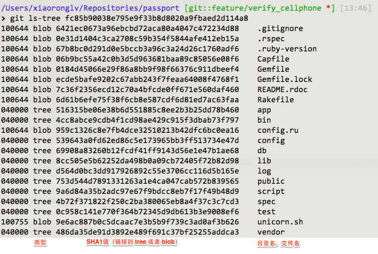
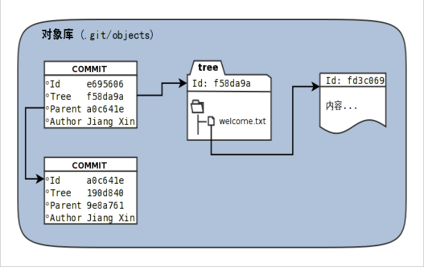
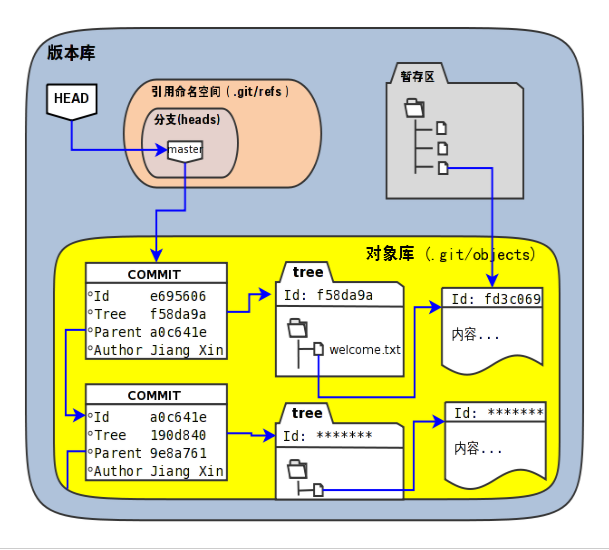

#git 对象
- 对象类型
Blob、Tree、Commit、Tag
- blob对象
新文件纳入到 Git 后会被五马分尸，它的内容被扔到在一个 blob 对象中，它的对象名是基于内容运算生成的一个 40 个字符的 SHA1 值。
blob 没有文件名，只有内容。

- tree对象
tree对象是指针，指向：1.其他 small tree（子级 tree） 2.blob

- commit对象
一个 commit 对象由以下几部分组成：1.作者 2.提交者 3.注释 4.指向一个 big tree 的指针

- 对象保存位置
Git库中的objects目录下了（ID的前两位作为目录名，后38位作为文件名）
- 查看对象的类型 
>>$ git cat-file -t 对象id（不必写全四十位ID），只要开头几位不冲突即可
- 查看对象的内容
>>$ git cat-file -p 对象ID

- 几种对象的关系图
  

- 版本库结构图
  

- 关于哈希值
  哈希(hash)是一种数据摘要算法（或称散列算法），是信息安全领域当中重要的理论基石。该算法将任意长度的输入经过散列运算转换为固定长度的输出。固定长度的输出可以称为对应的输入的数字摘要或哈希值。例如SHA1摘要算法可以处理从零到一千多万个TB的输入数据，输出为固定的160比特的数字摘要。两个不同内容的输入即使数据量非常大、差异非常小，两者的哈希值也会显著不同。

- 为何采用哈希值不使用顺序的数字提示
集中式版本控制系统因为只有一个集中式的版本库，可以很容易的实现依次递增的全局唯一的提交号，像Subversion就是如此。Git作为分布式版本控制系统，开发可以是非线性的，每个人可以通过克隆版本库的方式工作在不同的本地版本库当中，在本地做的提交可以通过版本库之间的交互（推送/push和拉回/pull操作）而互相分发，如果提交采用本地唯一的数字编号，在提交分发的时候不可避免的造成冲突。这就要求提交的编号不能仅仅是本地局部有效，而是要“全球唯一”。Git的提交通过SHA1哈希值作为提交ID，的确做到了“全球唯一”

- 访问git库中的对象的方法
>采用部分的SHA1哈希值。不必写全40位的哈希值，只采用开头的部分，不和现有其他的冲突即可。
>使用master代表分支master中最新的提交，使用全称refs/heads/master亦可。
>使用HEAD代表版本库中最近的一次提交。
>符号` ^可以用于指代父提交。例如：
>>HEAD^代表版本库中上一次提交，即最近一次提交的父提交。
>>HEAD^^则代表HEAD^的父提交。

>对于一个提交有多个父提交，可以在符号^后面用数字表示是第几个父提交。例如：
>>a573106^2含义是提交a573106的多个父提交中的第二个父提交。
>>HEAD^1相当于HEAD^含义是HEAD多个父提交中的第一个。
>>HEAD^^2含义是HEAD^（HEAD父提交）的多个父提交中的第二个。

>符号~<n>也可以用于指代祖先提交。下面两个表达式效果等同：
>>a573106~5
>>a573106^^^^^

>提交所对应的树对象，可以用类似如下的语法访问。
>>a573106^{tree}

>某一此提交对应的文件对象，可以用如下的语法访问。
>>a573106:path/to/file

>暂存区中的文件对象，可以用如下的语法访问。
>>:path/to/file

#config文件介绍
- 在config中生成配置文件 
>>$ git remote add origin 地址

指定远程版本库的名称（origin）、URL 和一个用于获取操作的 引用规范（refspec）

>>url=远程仓库地址
>>fetch = +refs/heads/*:refs/remotes/origin/*

引用规范的格式由一个可选的 + 号和紧随其后的 <src>:<dst> 组成， 其中 <src> 是一个模式（pattern），代表远程版本库中的引用； <dst> 是本地跟踪的远程引用的位置。 + 号告诉 Git 即使在不能快进的情况下也要（强制）更新引用。

- 只获取远程master分支，而非所有分支，Git 获取服务器中 refs/heads/ 下面的所有引用，并将它写入到本地的 refs/remotes/origin/ 中：
>>fetch = +refs/heads/master:refs/remotes/origin/master
- 可以在配置文件中指定多个用于获取操作的引用规范
- 不能在模式中使用部分通配符，以下是不规范的例子：
>>fetch = +refs/heads/qa*:refs/remotes/origin/qa*

###推送
- 推送指定分支到远程服务器的指定分支：
>>$ git push origin master:refs/heads/qa/master

- 每次都按照指定的推送方式推送，可以在config文件中配置一项push
- 删除远程服务器的某分支：
>>$ git push origin :topic

>>$ git push origin --delete topic

#基础篇：
Git 可以使用四种不同的协议来传输资料：本地协议（Local），HTTP 协议，SSH（Secure Shell）协议及 Git
协议。
本质上，四种传输方式都是为了解决协作共享的需求。本机服务（local），网络服务，
- 访问服务器上分支master的提交记录：
>>$ git log origin/master

>>$ git log remotes/origin/master

>>$ git log refs/remotes/origin/master

#.git文件的作用
description 文件仅供 GitWeb 程序使用
config 文件包含项目特有的配置选项
info 目录包含一个全局性排除（global exclude）文件，用以放置那些不希望被记录在 .gitignore文件中的忽略模式（ignored patterns）
hooks 目录包含客户端或服务端的钩子脚本（hook scripts）
objects 目录存储所有数据内容
refs 目录存储指向数据（分支、远程仓库和标签等）的提交对象的指针
HEAD 文件指向目前被检出的分支
index 文件保存暂存区信息